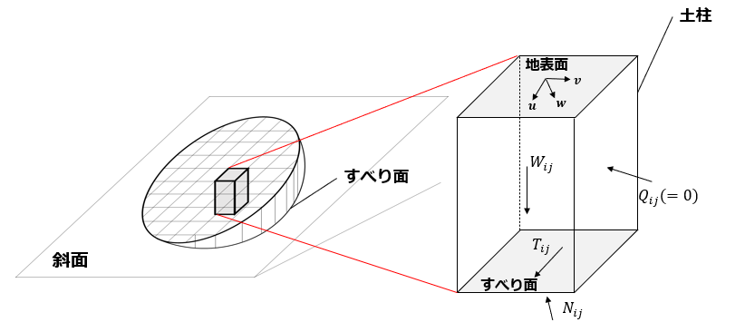

# 3D_slope_stability (Hovland法を用いた斜面安定解析)

- 3次元極限平衡法に基づく斜面安定解析を行うためのFortranコード
- Hovland法を用いた斜面安定解析
- すべり面に楕円体を仮定した円弧すべり計算


## Hovland法による安全率の算出



ある崩壊面（すべり面）を仮定したときに，その土塊を土柱に分割して作用する力を算定．  
滑動力と抵抗力の比として安全率$`F`$を以下のように表現する．

```math
F = \frac{\sum_i \sum_j \{cA + (N_{ij}-u_{ij}A)\tan \phi \}}{\sum_i \sum_j T_{ij}}
```

$i, j$：それぞれ土柱の$x,y$方向の番号  
$T_{ij}$：土柱のせん断力  
$N_{ij}$：すべり面上の垂直力  
$W_{ij}$：土柱重量  
$u_{ij}$：間隙水圧  
$c$：粘着力  
$A$：土柱のすべり面の面積   
$\phi$：内部摩擦角

間隙水圧$`\mathbf{u}_{ij}`$については，Green-Amptモデルによる浸透解析の結果を使用．
浸透解析のコードについては，[Infiltration_sflow](https://github.com/K-Tozato/infiltration_sflow)のページを参照．

Hovland法では，土柱側面に働く力をゼロとして仮定して安全率を算出する．  
垂直力方向の力のつり合いとすべり体全体でのすべり方向に垂直な方向$\bm{v}$のモーメントのつり合いを考えれば以下のようになる．

```math
( \mathbf{T}_{ij} + \mathbf{N}_{ij} + \mathbf{W}_{ij}) \cdot \mathbf{n}_{ij} = 0  
```

```math
\sum_i \sum_j ( \mathbf{r}_b\times\mathbf{T}_{ij} + \mathbf{r}_b\times\mathbf{N}_{ij} + \mathbf{r}_g\times\mathbf{W}_{ij} )\cdot \mathbf{v} = 0  
```


$\\mathbf{u}$：すべり方向を表現する単位ベクトル  
$\\mathbf{w}$：地表面に垂直で地中方向を向く単位ベクトル  
$\mathbf{v}$：$`\mathbf{v}=\mathbf{u}\times\mathbf{w}`$で求められる方向（単位ベクトル）  
$`\mathbf{T}_{ij}=T_{ij}\mathbf{t}_{ij}, \mathbf{N}_{ij}=N_{ij}\mathbf{n}_{ij}, \mathbf{W}_{ij}=W_{ij}\mathbf{g}`$：せん断力，垂直力，重力のベクトル表現  
$`\mathbf{t}_{ij}, \mathbf{n}_{ij}, \mathbf{g}`$：：それぞれの力の方向を表す単位ベクトル   
$`\mathbf{r}_b, \mathbf{r}_g`$：楕円体の回転中心から土柱底面中心，土柱重心までの位置ベクトル  

上記3式から，安全率は以下の式のように書き換えられる．
```math 
F= \frac{\sum_i\sum_j (\mathbf{t}_{ij}\times\mathbf{r}_b)\cdot\mathbf{v} [cA - \{W_{ij}(\mathbf{g}\cdot\mathbf{n}_{ij}) + u_{ij}A)\}\tan\phi]}{\sum_i\sum_j W_{ij}\{ -(\mathbf{g}\cdot\mathbf{n}_{ij})(\mathbf{r}_b\times\mathbf{n}_{ij})\cdot\mathbf{v}+(\mathbf{r}_g\times\mathbf{g})\cdot\mathbf{v} \}}
```


## 解析コードの説明

### 入力ファイル
入力データについては，"input"のディレクトリに格納

- **coordinate.txt**  
  座標データ．左の行からx座標，y座標，z座標
- **num_node.txt**  
  対象領域のx方向，y方向の節点数

上記の2つについては，[Infiltration_sflow](https://github.com/K-Tozato/infiltration_sflow)と同じ．   


- **gwater_case.txt**  
  どの浸透解析結果を読み込むかのファイル．  
  浸透解析結果(water_depth_level_××××.txt)の××××の数字の範囲を指定．  
- **infsupdip.dat**  
  安全率の算出の対象とする斜面角の範囲
- **parameter.dat**  
  斜面安定解析のパラメータ   
  左から(初期の)粘着力，内部摩擦角，単位体積重量，(飽和時の)粘着力，内部摩擦角，単位体積重量    


- **すべり形状(楕円体形状)に関する入力ファイル**
  - ru.txt  
    長軸方向($`\mathbf{u}`$方向)の楕円体の半径のデータ  
    検討する分縦に並べて書く   
  - rv.txt
    短軸方向($`\mathbf{v}`$方向)の長さに関するデータ  
    ru.txtで指定した長さに対する割合として，検討する分縦に並べて書く  
  - rw.txt  
    深さ方向($`\mathbf{w}`$方向)の長さに関するデータ  
    ru.txtで指定した長さに対する割合として，検討する分縦に並べて書く  
  - center.txt  
    楕円体の中心位置に関するデータ  
    深さ方向の半径に対する割合として指定 (1未満)
    0のとき，地表面位置に回転中心が来る

ここに楕円体の図を入れる．

### コードの流れ

**1. 浸透深さデータの指定**  
- gwater_case.txt

**2. データの読み込み(subroutine datain)**  
- 座標・地形データ(num_node.txt, coordinate.txt)
- 土質パラメータ(parameter.dat)
- 対象とする斜面の斜面角の範囲(inpsupdip.dat)

**3. 斜面角度の算出と対象斜面の抽出 (subroutine angle)**  
- 各メッシュの斜面角度を算出
- 対象とする斜面角の範囲内の地点を抽出
- 3つの単位ベクトル$`\mathbf{u,v,w}`$を対象地点ごとに計算

**4. 対象とする楕円体(すべり面)形状の設定 (subroutine ell_size)**  
- ru.txt, rv.txt, rw.txt, center.txtを読み込み，pellに格納

**5. 安全率の算定 (subroutine hovland_calc 前半)**  
- 浸透深さデータの読み込み
- 各地点，各すべり面形状ごとに安全率を算出．
  - 回転中心座標を算出し，楕円体範囲内にある土柱を抽出
  - 楕円体範囲内の各土柱について，すべり面深さを算出し，土柱重量・間隙水圧を算定
  - すべり面のz座標から$`\mathbf{n}_{ij}, \mathbf{t}_{ij}`$を算出
  - 安全率の式の分母・分子に土柱の数分加算していき，安全率を算出

**6. ファイルの書き出し (subroutine hovland_calc 後半)**  
- 安全率の空間分布データをoutputのディレクトリに"sfactor_xxxx.txt"（xxxxは浸透解析の番号と一致）として出力
- コメントアウトを外せば，崩壊深分布も"zvol_xxxx.txt"として出力可能．


### コード内の主な変数

- 座標に関する変数  

| 変数名     | 次元          |単位    | 説明                                   |   
| :------:  | :----:        | :----: | :-------------                        |   
| nx, ny    | -             | -      | x,y方向の節点数，途中から要素数を表現    |   
| xx (yy)   | nx (ny)       | [m]   | x,y方向の節点座標                       |   
| gl        | nx×ny         | [m]   | 節点の標高値の行列                      |   
| dx, dy    | -             | [m]   | x,y方向の空間解像度                     |   
| xxn (yyn) | nx-1 (ny-1)   | [m]   | x,y方向の要素中心の座標                  |   
| gl        | (nx-1)×(ny-1) | [m]   | 要素中心の標高値の行列                   |   


- 入力パラメータに関する変数
ここでは，パラメータは空間的に一様を仮定   

| 変数名     | 次元   |単位      | 説明                           |   
| :------:  | :----: | :----:   | :-------------                 |   
| gd, gs    | -      | [kN/m^3] | 初期・飽和時の単位体積重量       |   
| pd, ps    | -      | [°]      | 初期・飽和時の内部摩擦角         |   
| cd, cs    | -      | [kPa]    | 初期・飽和時の粘着力            |   
| sra       | 2      | [°]      | 斜面安定解析の対象とする傾斜角度  |   


- 斜面安定解析に関する変数

| 変数名     | 次元    |単位     | 説明                               |   
| :------:  | :----:  | :----: | :-------------                      |   
| nn         | -      | -      | 対象地点数                           |     
| ne         | -      | -      | 検討する斜面形状数                    |     
| nsl        | nn × 2 | -      | 対象となる地点番号 (x,yそれぞれの番号) |   
| nep        | ne × 2 | -      | 楕円体内部の土柱番号(x,yそれぞれの番号)|   
| nell       | ne × 2 | -      | 対象土柱メッシュにおける(節点の深さ)>0となる地点数(3 or 4) <br> 上記が3となるとき(節点の深さ)>0とならない節点の番号|   
| uu,vv,ww   | nn × 3 | -      | 斜面安定解析の対象とする傾斜角度  |   
| pell       | nn × 4 | -      | 楕円体形状パラメータを格納する変数 (ru, rv, rw, center) |    
| fsp        | ne     | -      |  各楕円体形状に対する安全率の値|    
| zvp        | ne     | [m]    |  各楕円体形状に対する崩壊深さの値|    

1つの浸透深さデータに対して，nn×ne（(対象地点数)×(斜面形状数)）の安全率計算を実施   

- 空間分布データ

| 変数名    | 次元           |単位    | 説明              |   
| :------:  | :----:        | :----: | :-------------   |   
| zz        | (nx-1)×(ny-1) | [m]    | 浸透深さの空間分布 |     
| fs        | (nx-1)×(ny-1) | -      | 安全率の空間分布   |     
| zvol      | (nx-1)×(ny-1) | [m]    | 崩壊深さの空間分布 |   

安全率は複数検討したすべり面形状のうち最小のものをその地点の安全率として算出   
崩壊審については最大のものをその地点の崩壊審として算出   


